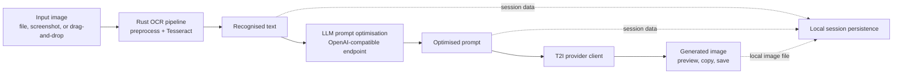

# Imagio: Optical Character Recognition to Image Generation

Imagio is a macOS desktop application that transforms text-bearing images into
new visual content through an inspectable pipeline:

1. acquire an image from a file, screenshot, or drag-and-drop action;
2. preprocess the image and recognise its text with Tesseract OCR;
3. refine the recognised text or synthesise an image-ready prompt with a
   configurable large language model (LLM) endpoint; and
4. send the prompt to a selected text-to-image (T2I) backend, then preview,
   copy, or save the returned image.

This repository contains the application implementation developed for the
M.Eng. report *Optical Character Recognition to Image Generation*. It focuses
on integrating OCR, prompt optimisation, and image generation in one
interactive desktop workflow while retaining user control at each stage.

## System Overview



The desktop shell is implemented with Tauri 2. The Rust host process performs
OCR, image preprocessing, screenshot capture, file operations, and clipboard
operations. A React and TypeScript WebView presents the interface, maintains
sessions, invokes LLM/T2I requests, and coordinates the full workflow through
typed Tauri commands.

The application supports manual inspection of intermediate results as well as
an automated sequence in which OCR output is refined, converted into a prompt,
sent for image generation, and saved after completion.

## Implemented Subsystems

### OCR And Adaptive Preprocessing

The OCR subsystem is implemented in Rust under `src-tauri/src/`. Recognition is
performed using Tesseract through the Rust `tesseract` binding. The language
selector supports the traineddata language packs available to the local
Tesseract installation, including English, simplified and traditional Chinese,
Japanese, Korean, French, German, and Spanish when those packs are installed.

Before recognition, the user may configure an ordered preprocessing pipeline:

1. border removal;
2. skew correction using a Hough-transform or projection-profile approach;
3. Gaussian or bilateral noise reduction;
4. brightness and contrast adjustment;
5. sharpening;
6. contrast-limited adaptive histogram equalisation (CLAHE);
7. morphological refinement; and
8. binarisation using Otsu, adaptive, mean, or Sauvola thresholding.

An adaptive mode calculates image-quality measurements and selects
preprocessing parameters automatically. This is intended for photographs,
screenshots, and degraded document captures where a fixed configuration is not
appropriate for every input.

### Prompt Optimisation

The prompt subsystem accepts OCR text and supports two related operations:
text refinement for correcting common recognition artefacts, and prompt
synthesis for converting the content into a visually descriptive prompt. The
generated prompt can be reviewed or edited before image generation.

The LLM client communicates through an OpenAI-compatible Chat Completions
interface. A local Ollama endpoint can therefore be used for local text
processing, while a remote compatible API can be selected by changing the
base URL, model name, and API key in the settings panel or local configuration
file.

### Image Generation And Persistence

The generation layer provides a common UI contract over multiple generation
clients. Nano Banana is the default text-to-image (T2I) model in the
application and provides the primary generation path for the workflow.
Supported alternative models can still be selected through the settings panel
when required. Responses are normalised to a local image preview regardless of
whether the provider returns an image directly or requires polling for a
completed job.

Generated images are persisted under the application's local data directory so
that a session can be restored. The user can also explicitly save a result to a
chosen path or copy an image to the clipboard.

### Sessions And Workflow Control

Each input image is represented as an independent session containing its image,
OCR state, prompt state, selected configuration, and generated output. The
application supports multiple sessions, session switching, locally persisted
history, and automation controls for OCR refinement, prompt generation, image
generation, and image saving.

## Repository Structure

```text
Imagio/
|-- public/
|   `-- config.local.json.example   Local configuration template
|-- src/
|   |-- components/                 Shared interface components
|   |-- context/                    Session and automation contexts
|   |-- features/
|   |   |-- ocr/                    OCR-facing UI and state
|   |   |-- promptOptimization/     Prompt synthesis and model selection
|   |   `-- imageGeneration/        Provider clients and image handling
|   |-- hooks/                      Workflow and persistence hooks
|   `-- utils/                      LLM transport and utility functions
|-- src-tauri/
|   |-- src/
|   |   |-- ocr/                    OCR pipeline orchestration
|   |   |-- preprocessing/          Geometric and filtering operations
|   |   |-- binarization/           Thresholding and CLAHE operations
|   |   |-- morphology/             Morphological transformations
|   |   `-- quality/                Adaptive-mode quality metrics
|   |-- icons/                      Bundle icons
|   |-- resources/                  macOS bundle resources
|   |-- Cargo.toml
|   `-- tauri.conf.json
|-- package.json
`-- vite.config.ts
```

## Requirements

Imagio has been developed and verified on macOS. Development requires:

- Node.js 20.19 or later, or Node.js 22.12 or later;
- pnpm;
- Rust 1.77.2 or later;
- Tesseract OCR with the required language packs installed; and
- API credentials only for any remote LLM or image-generation provider used.

On macOS with Homebrew, Tesseract may be installed with:

```bash
brew install tesseract
```

Additional traineddata language packs must be available to Tesseract before
selecting the corresponding recognition language in the application.

## Running The Application

### Download The macOS Application

Prebuilt Apple silicon macOS application bundles are published on the
[GitHub Releases page](https://github.com/gy-0/Imagio/releases/latest).
Before launching a downloaded release, install the OCR runtime and language
data:

```bash
brew install tesseract tesseract-lang
```

Download the macOS `.zip` release asset, extract `Imagio.app`, and move it to
the `Applications` folder. Depending on local macOS security settings, the
first launch of a downloaded application may require confirmation through
Finder's **Open** action.

### Run From Source

Install JavaScript dependencies:

```bash
pnpm install
```

Start the desktop application in development mode:

```bash
pnpm run tauri:dev
```

Build the macOS application bundle:

```bash
pnpm run tauri:build
```

The release bundle is produced under
`src-tauri/target/release/bundle/macos/Imagio.app`.

## Local Configuration

The repository includes `public/config.local.json.example`. To define local
service settings without committing credentials, create
`public/config.local.json`:

```json
{
  "llm": {
    "apiBaseUrl": "http://127.0.0.1:11434/v1",
    "apiKey": "",
    "modelName": "gpt-oss:20b",
    "temperature": 0.7
  },
  "selectedModel": "nano-banana",
  "bltcyApiKey": "your-image-generation-api-key"
}
```

To reproduce a local-first text-processing setup, serve an
OpenAI-compatible model through Ollama and set its endpoint and model name in
this local configuration file. The example above uses `gpt-oss:20b`; another
compatible local model may be substituted. For a remote LLM provider, replace
the URL and supply its API key.
The image-generation configuration shown above selects Nano Banana as the
default model. Image generation requires network access and its corresponding
credential; alternative supported models can be selected and configured in
the Settings panel.

The same configuration values may be changed in the application's Settings
panel. `public/config.local.json` is excluded from version control.

## Development Verification

The current source tree can be checked with:

```bash
pnpm run build
pnpm test -- --run
cargo check --manifest-path src-tauri/Cargo.toml
```

## Scope And Limitations

The repository provides the integrated desktop application and its
preprocessing, workflow, and provider-client implementation. Recognition
quality depends on the installed Tesseract language models and the
characteristics of the input image. LLM-based refinement may alter text and
should be reviewed when textual fidelity matters.

OCR and local LLM processing can be run without sending source text to a
remote LLM when a local compatible endpoint is configured. Image generation
uses a selected remote provider and therefore requires a network connection and
appropriate credentials. The application has been developed and tested on
macOS; portability to other platforms is not claimed by this repository.

## Acknowledgements

Imagio builds upon [Tesseract OCR](https://github.com/tesseract-ocr/tesseract),
[Tauri](https://tauri.app/), and [React](https://react.dev/).
